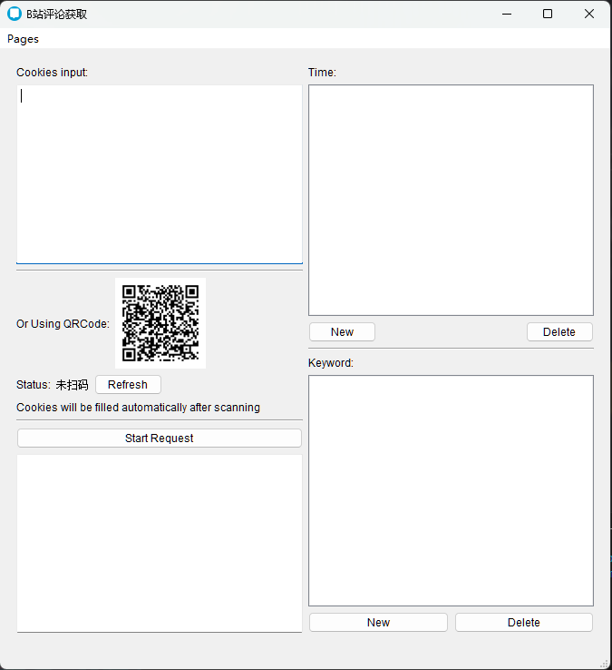
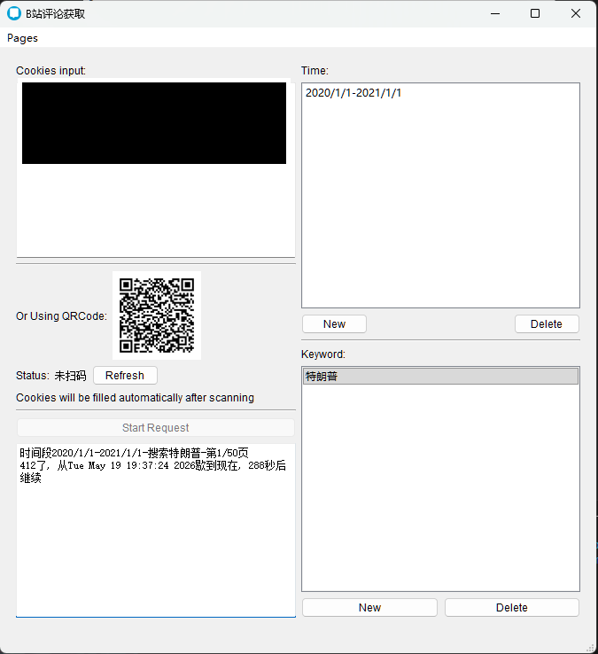

# 🎬 B站评论分析工具

一个基于 PyQt5 的桌面工具，通过关键词和时间范围搜索 B站 视频，批量获取评论并生成词云分析图。

## 功能

- **视频搜索** — 按关键词 + 时间范围搜索 B站 视频，支持多关键词和多时间段
- **评论批量获取** — 自动遍历搜索结果，批量爬取视频评论（支持断点续爬）
- **词云分析** — 对评论进行中文分词、词性过滤，生成可视化词云图
- **扫码登录** — 内置二维码扫码登录，自动获取 B站 Cookies
- **数据导出** — 结果自动保存为 Excel，词云图输出为 PNG

## 截图

### 主界面



### 运行过程



### 词云分析结果


## 快速开始

```bash
# 克隆仓库
git clone https://github.com/Bluesky303/BiliBili-Comments-Crawler.git
cd BiliBili-Comments-Crawler

# 安装依赖
pip install -r requirements.txt

# 运行
python main.py
```

### 使用说明

1. 打开程序后，通过 **二维码扫码** 或 **手动粘贴 Cookies** 登录 B站
2. 在 **关键词** 列表中添加搜索词（如"特朗普"）
3. 在 **时间范围** 中添加需要分析的时间段（如 `2020/1/1-2021/1/1`）
4. 调整搜索页数、排序方式等参数
5. 点击 **开始** 运行，等待结果生成

## 技术栈

| 模块 | 技术 |
|------|------|
| GUI 框架 | PyQt5 |
| 网络请求 | requests |
| 中文分词 | jieba |
| 词云生成 | wordcloud |
| 数据处理 | pandas + openpyxl |
| 认证方式 | B站 官方 API + QR 码登录 |

> 本项目直接调用 B站 公开 API，API 参考自 [bilibili-API-collect](https://github.com/SocialSisterYi/bilibili-API-collect)

## 项目结构

```
BiliBili-Comments-Crawler/
├── main.py              # 入口
├── crawler/
│   ├── crawler.py       # 爬取流程编排
│   ├── search.py        # 视频搜索 API
│   ├── reviews.py       # 评论获取 API
│   ├── wordsCount.py    # 分词 & 词云生成
│   └── path.py          # 路径管理
├── ui/
│   ├── uiFunction.py    # 主窗口逻辑
│   ├── main_ui.py       # UI 布局
│   ├── generateQR.py    # 二维码登录
│   ├── delegate.py      # 时间格式校验
│   └── startrequest.py  # 后台请求线程
└── assets/
    └── screenshots/     # 功能截图
```

## 免责声明

本工具仅用于学习交流和技术研究目的，不得用于任何商业用途。使用者应自行承担使用风险。
